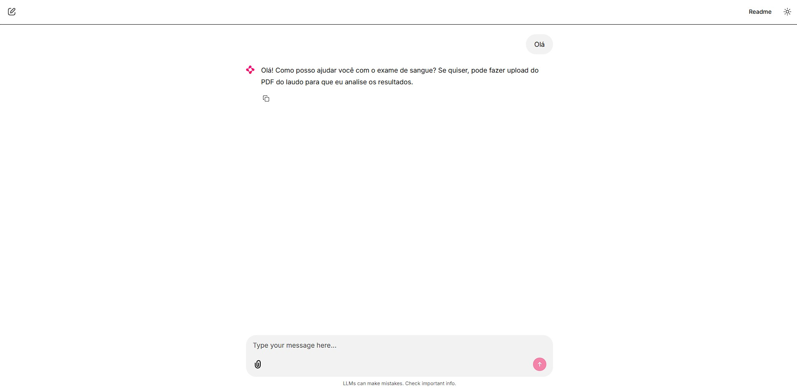
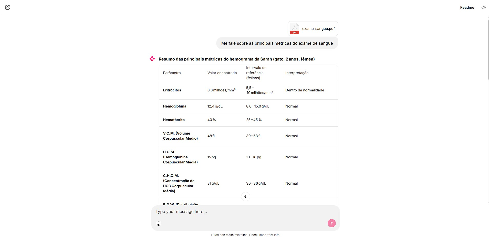
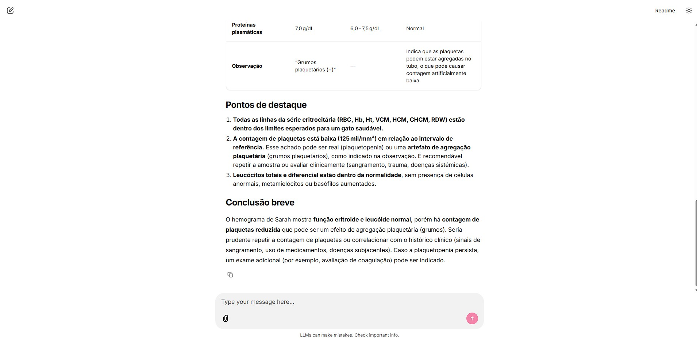
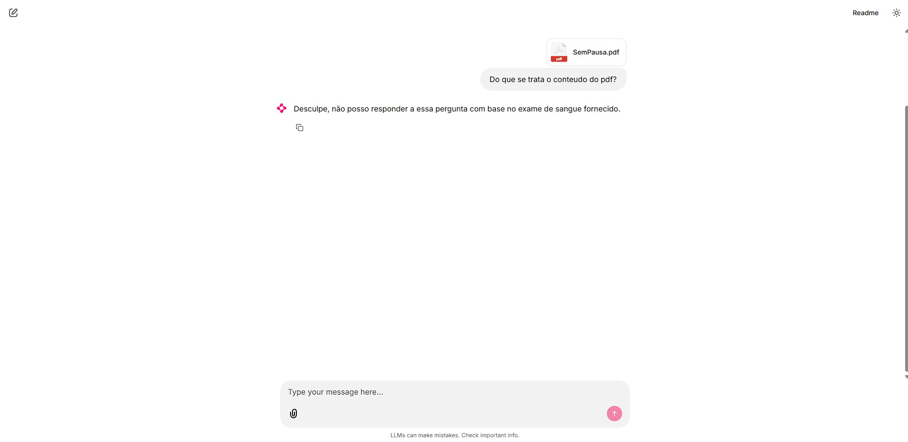

# ChatBot Chainlit

Chatbot conversacional com interface web construído com **Chainlit**, **LangGraph** e **LangChain**, rodando modelos locais via **Ollama**. O projeto permite comparar três abordagens diferentes de resposta com base em documentos enviados pelo usuário.

## Modos de operação

O modo é controlado pela variável `USE_RAG` no topo do arquivo `app.py`:

### Modo 1 — Sem RAG (`USE_RAG = False`)

```python
# app.py
USE_RAG = False
```

O texto do arquivo enviado pelo usuário é extraído e colado diretamente no prompt, junto com a mensagem. O modelo recebe tudo como contexto bruto.

```
START → response → END
```

### Modo 2 — RAG via nó (`USE_RAG = True`)

```python
# app.py
USE_RAG = True
```

O arquivo enviado é indexado no FAISS da sessão. A cada mensagem, um nó de recuperação busca os trechos mais relevantes antes de passar para o modelo. O índice é isolado por sessão — cada usuário tem o seu.

```
START → rag → response → END
```

### Modo 3 — RAG via tool (experimental)

O agente tem acesso a uma tool `retrieve_documents_tool` que ele pode chamar quando julgar necessário. Para ativar, configure o agente em `core/agents.py` passando a tool:

```python
from core.rag.tools import retrieve_documents_tool

agent = create_agent(
    model=model,
    tools=[retrieve_documents_tool],
    system_prompt=SystemMessage(content=system_prompt),
)
```

```
START → response (com tool disponível) → END
```

## Exemplos









## Tecnologias

| Tecnologia | Versão | Função |
|---|---|---|
| [Chainlit](https://chainlit.io) | 2.11.1 | Interface web do chat |
| [LangGraph](https://langchain-ai.github.io/langgraph/) | 1.2.4 | Orquestração do agente com estado |
| [LangChain](https://langchain.com) | 1.3.3 | Integração com modelos e ferramentas |
| [langchain-ollama](https://python.langchain.com/docs/integrations/llms/ollama) | 1.1.0 | Conexão com modelos locais via Ollama |
| [FAISS](https://github.com/facebookresearch/faiss) | — | Índice vetorial para recuperação semântica |
| [pypdf](https://pypdf.readthedocs.io) | 6.12.2 | Extração de texto de arquivos PDF |
| [Ollama](https://ollama.com) | — | Execução local de LLMs e embeddings |

## Pré-requisitos

- Python 3.10+
- [Ollama](https://ollama.com) instalado e rodando localmente
- Modelo de embedding `nomic-embed-text` disponível no Ollama (necessário para os modos com RAG)

```bash
ollama pull nomic-embed-text
```

## Instalação

```bash
# 1. Clone o repositório
git clone <url-do-repositorio>
cd ChatBot-Chainlit

# 2. Crie e ative o ambiente virtual
python -m venv venv
venv\Scripts\activate  # Windows
# source venv/bin/activate  # Linux/Mac

# 3. Instale as dependências
pip install -r requirements.txt

# 4. Certifique-se que o Ollama está rodando com o modelo configurado
ollama serve
ollama pull <nome-do-modelo>
```

## Execução

```bash
chainlit run app.py -w --port 8080
```

Acesse `http://localhost:8080` no navegador.

## Estrutura do projeto

```
.
├── app.py                  # Ponto de entrada Chainlit — define USE_RAG
├── core/
│   ├── agents.py           # Configuração do modelo e agente LangChain
│   ├── graph.py            # Grafo sem RAG (texto colado no prompt)
│   ├── graph_rag.py        # Grafo com nó RAG antes do response
│   ├── nodes.py            # Nós: rag() e response()
│   ├── state.py            # Definição do estado da conversa
│   └── rag/
│       ├── vectorstore.py  # Criação e carregamento do índice FAISS
│       └── tools.py        # Tool de recuperação para o agente
├── docs/                   # PDFs para indexação fixa (uso futuro)
├── config/
│   └── faiss_index/        # Índice FAISS salvo em disco
├── assets/                 # Imagens de exemplo
└── requirements.txt
```
